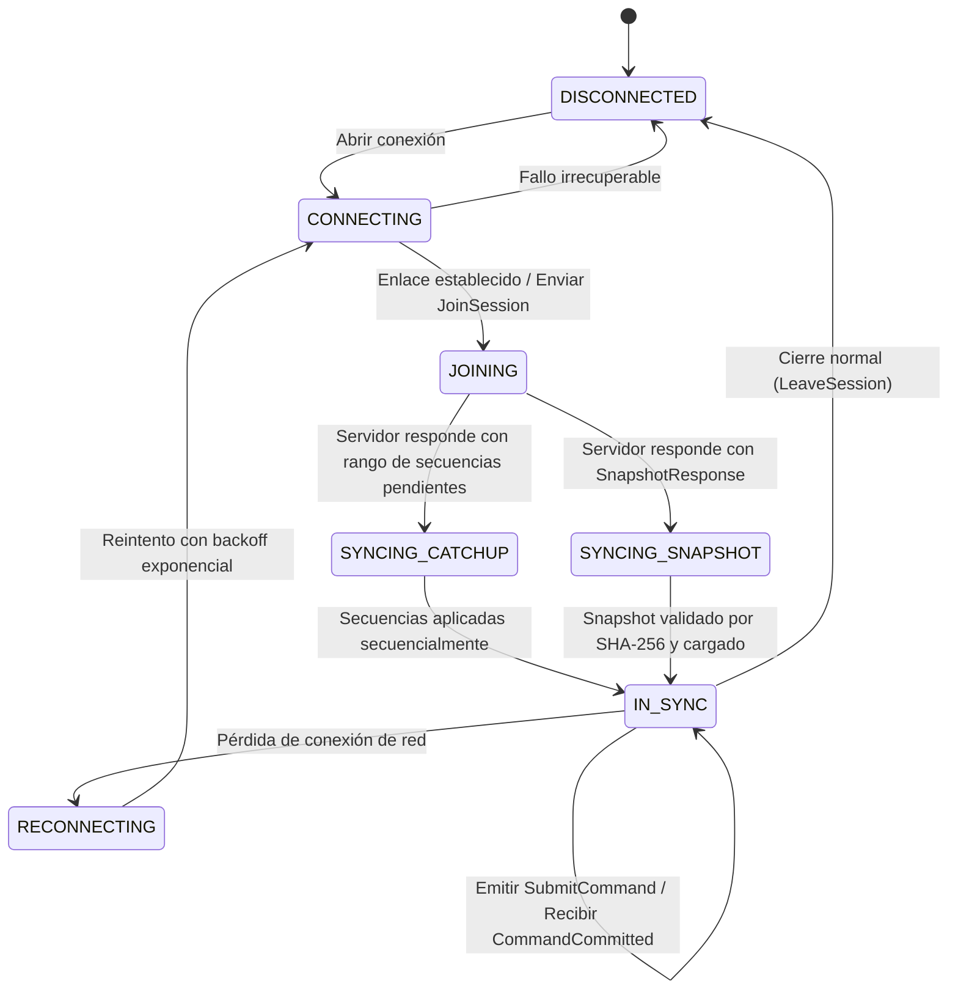
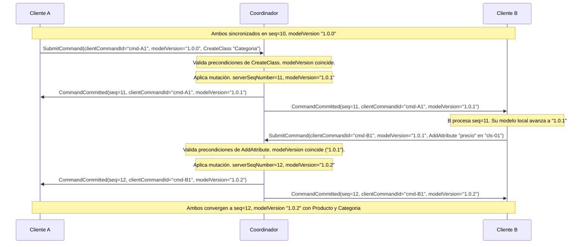
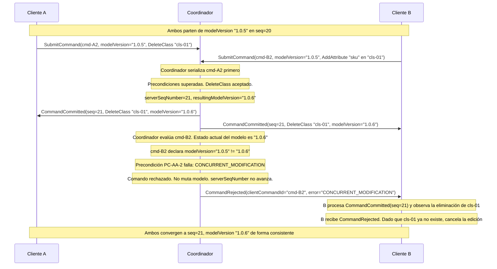
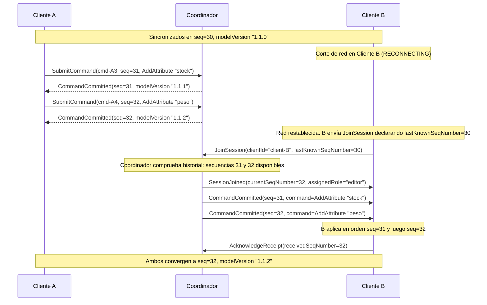
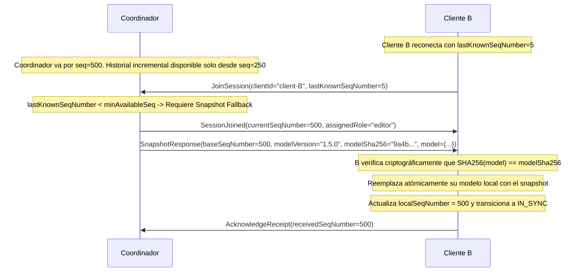
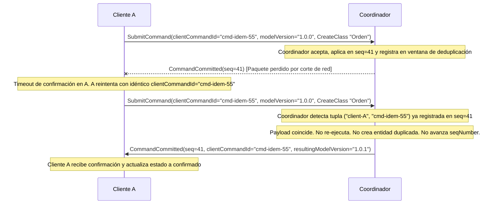

# Contrato de protocolo de colaboración — `collaboration-protocol` v1

- **Versión del contrato:** 1.0.0
- **Estado:** accepted
- **Fecha:** 2026-09-20
- **Autoridad:** Product Owner (ADR-0000, PROJECT.md)
- **Depende de:** `docs/contracts/model-commands-v1.md` (contractVersion "1"), `docs/contracts/domain-model-v1.md` (contractVersion "1")
- **Relacionado con:** `docs/contracts/mobile-offline-v1.md`, `packages/collaboration-protocol/README.md`, ADR-0003 (`docs/adr/0003-realtime-collaboration.md`)

---

## 1. Propósito y alcance

Este contrato define el protocolo normativo, formal y tecnológicamente neutral para la sincronización y coedición colaborativa sobre el modelo canónico del editor CASE (`domain-model-v1.md`). Establece los formatos de mensajes, las transiciones de sincronización, las garantías de orden e idempotencia, y el manejo de concurrencia y reconexión entre múltiples participantes (clientes web CASE, aplicaciones móviles o servicios automatizados).

El contrato formaliza los siguientes ejes normativos:
1. **Identidad:** Identificadores estables y persistentes para sesiones, clientes y comandos.
2. **Orden:** Secuenciación causal y ordenación lineal observable (`seqNumber`) para garantizar consistencia eventual fuerte (Strong Eventual Consistency).
3. **Idempotencia:** Deduplicación de comandos por clave de emisor (`clientId` + `clientCommandId`), garantizando que reintentos de red no dupliquen mutaciones en el modelo.
4. **Autorización y roles:** Validación de permisos previa al procesamiento, sin efectos colaterales en caso de rechazo.
5. **Concurrencia:** Integración estricta con el control de concurrencia optimista (`modelVersion` y `CONCURRENT_MODIFICATION`) estipulado en `model-commands-v1.md`.
6. **Reconexión y sincronización incremental:** Recuperación de estado mediante retransmisión de operaciones perdidas (catch-up) tras desconexiones transitorias.
7. **Snapshots:** Checkpoints completos y consistentes con verificación de integridad criptográfica (SHA-256) para inicialización o recuperación de brechas históricas profundas.

### 1.1 Neutralidad tecnológica y algorítmica

Conforme a `packages/collaboration-protocol/README.md` y `docs/ARCHITECTURE.md`, este contrato define la semántica observable y el formato de los mensajes sin presuponer librerías de red, protocolos de capa física (WebSocket, SSE, WebRTC, gRPC o HTTP) ni la elección de algoritmos de sincronización o motores de persistencia. Esas decisiones pertenecen formalmente a `ADR-0003` (tarea `P6-002`) y no invalidan este contrato.

---

## 2. Envelope canónico y catálogo de mensajes

Toda comunicación de colaboración utiliza una estructura de sobre común (*envelope*).

### 2.1 Estructura del envelope

```json
{
  "protocolVersion": "1.0.0",
  "messageId": "string (UUID v4 generado por el emisor)",
  "sessionId": "string (identificador de la sesión de colaboración)",
  "modelId": "string (identificador del modelo canónico en edición)",
  "type": "string (nombre del mensaje canónico)",
  "timestamp": "string (ISO 8601 UTC en el momento de emisión)",
  "payload": {}
}
```

### 2.2 Mensajes de cliente a coordinador (C2S)

| Tipo | Descripción | Payload principal |
|---|---|---|
| `JoinSession` | Solicita unirse a una sesión de colaboración para un modelo. | `clientId`, `authToken`, `lastKnownSeqNumber`, `clientMetadata` |
| `LeaveSession` | Cierre voluntario y ordenado de la participación en la sesión. | `clientId`, `reason` |
| `SubmitCommand` | Propone la aplicación de un comando canónico del editor. | `clientCommandId`, `baseSeqNumber`, `command` (con `command.commandId == clientCommandId`) |
| `AcknowledgeReceipt` | Confirma la recepción y aplicación de secuencias ordenadas. | `clientId`, `receivedSeqNumber` |
| `RequestSnapshot` | Solicita la emisión de un snapshot completo del modelo. | `clientId`, `reason` |
| `Heartbeat` | Verificación de vivacidad y latencia del enlace. | `clientId`, `clientTimestamp` |

### 2.3 Mensajes de coordinador a cliente (S2C)

| Tipo | Descripción | Payload principal |
|---|---|---|
| `SessionJoined` | Confirma la unión a la sesión con estado y rol adjudicado. | `clientId`, `assignedRole`, `currentSeqNumber`, `snapshot` (opcional), `activeParticipants` |
| `CommandCommitted` | Notifica un comando validado, ordenado y aplicado al modelo. | `serverSeqNumber`, `originClientId`, `clientCommandId`, `resultingModelVersion`, `resultingSha256`, `command` |
| `CommandRejected` | Notifica al emisor el rechazo de su comando con causas normativas. | `originClientId`, `clientCommandId`, `baseSeqNumber`, `currentSeqNumber`, `errors` |
| `SnapshotResponse` | Entrega de un snapshot completo y consistente del modelo. | `baseSeqNumber`, `modelVersion`, `modelSha256`, `model`, `activeParticipants` |
| `PresenceUpdated` | Notifica cambios de presencia de los participantes de la sesión. | `participantId`, `status`, `metadata` |
| `SessionError` | Error de sesión o falla terminal que interrumpe la colaboración. | `errorCode`, `message`, `fatal` |
| `HeartbeatAck` | Confirmación de vivacidad. | `clientTimestamp`, `serverTimestamp` |

---

## 3. Identidad y autorización

### 3.1 Identificadores canónicos

1. **`sessionId`:** Identificador opaco (UUID v4) que define el ámbito de coedición sobre un `modelId`.
2. **`clientId`:** Identificador único (UUID v4) generado por la instalación del cliente y persistido de forma durable localmente, manteniéndose estable ante reinicios de la aplicación o reconexiones.
3. **`clientCommandId`:** Identificador único e inmutable (UUID v4) generado por el emisor para cada intento de comando lógico. **Regla de vinculación estricta:** En todo `SubmitCommand`, el `clientCommandId` del envelope DEBE ser exactamente igual al campo `command.commandId` del comando embebido (`clientCommandId == command.commandId`).
4. **`serverSeqNumber`:** Entero positivo monótonamente creciente (1, 2, 3...) asignado por el coordinador/secuenciador al registrar cada comando aplicado exitosamente.

### 3.2 Esquema de autorización y roles

El coordinador valida las credenciales recibidas en `JoinSession` y adjudica exactamente un rol normativo:

| Rol | Descripción | Capacidades autorizadas |
|---|---|---|
| `viewer` | Participante en modo solo lectura | Puede unirse a la sesión, recibir actualizaciones, solicitar snapshots y enviar heartbeats. Si emite `SubmitCommand`, este es rechazado inmediatamente con error `INSUFFICIENT_PERMISSIONS`. |
| `editor` | Colaborador activo con derechos de edición | Capacidades de `viewer` más autorización para emitir `SubmitCommand` sobre clases, atributos, asociaciones y paquetes del modelo. |
| `admin` | Administrador de la sesión | Capacidades de `editor` más gestión de sesiones, checkpoints y revocación de permisos. |

Si un comando es rechazado por autorización, el modelo canónico no sufre mutación alguna y el número de secuencia no avanza.

---

## 4. Ordenación y causalidad

### 4.1 Orden total observable

Para asegurar que todos los participantes alcancen el mismo estado determinista:
1. Las mutaciones aceptadas reciben un `serverSeqNumber` estrictamente consecutivo y ordenado linealmente.
2. Cada comando comprometido transiciona el modelo de una versión semántica `modelVersion` a `modelVersion'` (incremento `PATCH` según `model-commands-v1.md` §2.2).
3. Los clientes aplican los eventos `CommandCommitted` respetando estrictamente el orden secuencial de `serverSeqNumber`.
4. El estado del modelo queda unívocamente determinado por la tupla `(serverSeqNumber, modelVersion, modelSha256)`.

### 4.2 Causalidad y base declarada

Al emitir un `SubmitCommand`, el cliente declara:
- `baseSeqNumber`: El último `serverSeqNumber` procesado y reflejado en el estado local del cliente.
- `command.modelVersion`: La versión del modelo sobre la cual se originó la mutación.

---

## 5. Idempotencia y deduplicación

La idempotencia garantiza que duplicaciones accidentales de paquetes de red, retransmisiones automáticas o caídas de conexión no produzcan mutaciones duplicadas.

### 5.1 Deduplicación por clave de emisor

1. El coordinador mantiene un registro de deduplicación que almacena las tuplas confirmadas:
   `(clientId, clientCommandId) -> { serverSeqNumber, resultingModelVersion, resultingSha256, commandHash }`
2. **Reuso con contenido idéntico:** Si llega un `SubmitCommand` con un par `(clientId, clientCommandId)` ya registrado y cuyo contenido (`command`) es idéntico:
   - El comando no se vuelve a ejecutar.
   - El modelo no sufre mutación adicional.
   - No se genera un nuevo `serverSeqNumber`.
   - Se retransmite el `CommandCommitted` original al cliente emisor (comportamiento `noop`).
3. **Reuso con contenido divergente:** Si llega un `SubmitCommand` con un par `(clientId, clientCommandId)` ya registrado pero con un payload diferente en `command`:
   - Se rechaza inmediatamente con el error normativo `IDEMPOTENCY_PAYLOAD_MISMATCH`.
   - El modelo no se muta.
4. **Ventana de retención:** El registro de deduplicación se preserva durante la vida completa de la sesión activa de coedición y al menos 24 horas en almacenamiento persistente del coordinador.

### 5.2 Deduplicación en el cliente

El cliente registra localmente el último `serverSeqNumber` aplicado. Cualquier mensaje `CommandCommitted` recibido con `serverSeqNumber <= localSeqNumber` es descartado de forma idempotente sin alterar el estado.

---

## 6. Concurrencia y consistencia con `model-commands-v1`

El protocolo de colaboración respeta rigurosamente las precondiciones e invariantes establecidas en el contrato superior `model-commands-v1.md`.

### 6.1 Preservación del control de concurrencia optimista

Conforme a `model-commands-v1.md` §2.1 y §9:
1. Todo comando del editor declara `modelVersion` (la versión esperada del modelo).
2. La precondición obligatoria de concurrencia (paso 2 de validación) dicta:
   *Si `modelVersion` del comando no coincide con la versión actual del modelo en el momento de procesarlo, el comando DEBE ser rechazado con el código de error normativo `CONCURRENT_MODIFICATION`.*
3. El procesador del protocolo de colaboración **no reescribe ni muta silenciosamente** el campo `modelVersion` de un comando recibido, ni recalcula identidades (`commandId`).
4. Si dos clientes emiten comandos simultáneamente basados en la misma versión `V`:
   - El comando que se ordene en primer lugar transiciona el modelo a `V'`.
   - El segundo comando, al ser evaluado sobre el estado actual `V'`, presenta una versión desactualizada (`V != V'`).
   - El coordinador emite `CommandRejected` al segundo cliente con el error `CONCURRENT_MODIFICATION`.
   - El segundo cliente, al recibir `CommandCommitted` del primer comando y `CommandRejected` de su propio comando, actualiza su estado local a `V'`. Si el usuario desea mantener su cambio y este sigue siendo válido, el cliente formula un **nuevo** comando con un nuevo identificador (`clientCommandId`) y con la versión actualizada `V'`.

### 6.2 Invariante de no-mutación en rechazo

Si un comando es rechazado por concurrencia (`CONCURRENT_MODIFICATION`), por autorización o por cualquier otra precondición del catálogo de `model-commands-v1.md`:
- El modelo canónico permanece **estrictamente inalterado**.
- No se incrementa el contador de secuencias `serverSeqNumber`.
- Se envía el mensaje `CommandRejected` al emisor con el desglose de errores normativos.

---

## 7. Snapshots, reconexión y sincronización

### 7.1 Estructura del snapshot

Un snapshot captura el estado íntegro y autosuficiente del modelo canónico en un punto exacto de la secuencia:

```json
{
  "protocolVersion": "1.0.0",
  "snapshotId": "snap-6ba7b810-9dad-11d1-80b4-00c04fd430c8",
  "modelId": "model-01",
  "baseSeqNumber": 100,
  "modelVersion": "1.0.8",
  "modelSha256": "8f4625b90f4251f253e6022e3ea8536b9e4a5d89856f6c04f9958742888cf3e2",
  "createdAt": "2026-09-20T22:30:00Z",
  "model": {
    "contractVersion": "1",
    "id": "model-01",
    "name": "SistemaVentas",
    "version": "1.0.8",
    "classes": [],
    "associations": []
  }
}
```

### 7.2 Flujo de reconexión

Cuando un cliente experimenta una pérdida transitoria de red y recupera conectividad:
1. El cliente entra en estado `RECONNECTING` y envía `JoinSession` con su `clientId` y `lastKnownSeqNumber`.
2. El coordinador evalúa la brecha de secuencias:
   - **Sincronización incremental (Catch-up):** Si las operaciones desde `lastKnownSeqNumber + 1` hasta `currentSeqNumber` están disponibles en el historial reciente, el coordinador envía secuencialmente los mensajes `CommandCommitted` pendientes. El cliente los aplica en estricto orden y alcanza el estado `IN_SYNC`.
   - **Sincronización por Snapshot (Snapshot Fallback):** Si la brecha excede la capacidad de retención del historial o el cliente carece de estado local previo, el coordinador emite `SnapshotResponse`. El cliente verifica que el hash SHA-256 del modelo recibido coincida con `modelSha256`, reemplaza su copia local con el snapshot y actualiza su secuencia a `baseSeqNumber`.

---

## 8. Máquina de estados del participante

### 8.1 Diagrama de estados



| Estado | Descripción | Mutaciones del editor local |
|---|---|---|
| `DISCONNECTED` | Sin enlace con la sesión de coedición. | Bloqueadas o encoladas en cola offline conforme a `mobile-offline-v1.md`. |
| `CONNECTING` | Negociando conexión de transporte. | En espera. |
| `JOINING` | Handshake de sesión emitido, esperando respuesta. | Bloqueadas. |
| `SYNCING_CATCHUP` | Procesando lote secuencial de `CommandCommitted` pendientes. | Bloqueadas hasta procesar el lote completo. |
| `SYNCING_SNAPSHOT` | Descargando y validando snapshot completo del modelo. | Bloqueadas hasta sustitución atómica. |
| `IN_SYNC` | Estado nominal; sincronizado con el modelo activo. | Habilitadas; emisión mediante `SubmitCommand`. |
| `RECONNECTING` | Conexión interrumpida; ejecutando reintento con backoff. | Retenidas en búfer de salida local. |

---

## 9. Trazas normativas para dos clientes

Las siguientes trazas ilustran el intercambio determinista de mensajes entre dos clientes concurrentes (**Cliente A** y **Cliente B**) y el **Coordinador**.

### 9.1 Traza 1: Secuencia de comandos secuenciales con actualización de versión

#### Estado inicial
- `serverSeqNumber`: 10
- `modelVersion`: `"1.0.0"`
- Modelo contiene clase `cls-01` (`name: "Producto"`).
- Ambos clientes están en estado `IN_SYNC` en `seq = 10`.

#### Diagrama de secuencia



#### Mensajes paso a paso

1. **Cliente A emite `SubmitCommand`:**
   ```json
   {
     "protocolVersion": "1.0.0",
     "messageId": "msg-a101",
     "sessionId": "sess-main",
     "modelId": "model-01",
     "type": "SubmitCommand",
     "timestamp": "2026-09-20T22:40:01.000Z",
     "payload": {
       "clientCommandId": "cmd-A1",
       "baseSeqNumber": 10,
       "command": {
         "type": "CreateClass",
         "commandId": "cmd-A1",
         "modelId": "model-01",
         "modelVersion": "1.0.0",
         "payload": {
           "id": "cls-02",
           "name": "Categoria",
         }
       }
     }
   }
   ```

2. **Coordinador confirma y difunde `CommandCommitted` (seq = 11):**
   ```json
   {
     "protocolVersion": "1.0.0",
     "messageId": "srv-3001",
     "sessionId": "sess-main",
     "modelId": "model-01",
     "type": "CommandCommitted",
     "timestamp": "2026-09-20T22:40:01.100Z",
     "payload": {
       "serverSeqNumber": 11,
       "originClientId": "client-A",
       "clientCommandId": "cmd-A1",
       "resultingModelVersion": "1.0.1",
       "resultingSha256": "4b12c8e3...",
       "command": {
         "type": "CreateClass",
         "commandId": "cmd-A1",
         "modelId": "model-01",
         "modelVersion": "1.0.0",
       }
     }
   }
   ```

3. **Cliente B emite `SubmitCommand` referenciando la versión actualizada `"1.0.1"`:**
   ```json
   {
     "protocolVersion": "1.0.0",
     "messageId": "msg-b201",
     "sessionId": "sess-main",
     "modelId": "model-01",
     "type": "SubmitCommand",
     "timestamp": "2026-09-20T22:40:01.500Z",
     "payload": {
       "clientCommandId": "cmd-B1",
       "baseSeqNumber": 11,
       "command": {
         "type": "AddAttribute",
         "commandId": "cmd-B1",
         "modelId": "model-01",
         "modelVersion": "1.0.1",
         "payload": {
           "id": "attr-01",
           "classId": "cls-01",
           "name": "precio",
           "type": "Double",
           "nullable": false,
           "multiplicity": "1"
         }
       }
     }
   }
   ```

4. **Coordinador confirma y difunde `CommandCommitted` (seq = 12):**
   Ambos participantes alcanzan deterministamente la secuencia `seq = 12` y versión `"1.0.2"` con estado idéntico.

---

### 9.2 Traza 2: Concurrencia con rechazo determinista por `CONCURRENT_MODIFICATION`

Dos clientes emiten comandos simultáneos basados en la misma versión `"1.0.5"`. El primero en ser procesado avanza la versión del modelo; el segundo es rechazado normativamente conforme a `model-commands-v1.md`.

#### Estado inicial
- `serverSeqNumber`: 20, `modelVersion`: `"1.0.5"`.
- Modelo contiene clase `cls-01` (`name: "Producto"`).

#### Diagrama de secuencia



#### Mensaje de rechazo normativo recibido por Cliente B

```json
{
  "protocolVersion": "1.0.0",
  "messageId": "srv-err-901",
  "sessionId": "sess-main",
  "modelId": "model-01",
  "type": "CommandRejected",
  "timestamp": "2026-09-20T22:42:00.200Z",
  "payload": {
    "originClientId": "client-B",
    "clientCommandId": "cmd-B2",
    "baseSeqNumber": 20,
    "currentSeqNumber": 21,
    "errors": [
      {
        "code": "CONCURRENT_MODIFICATION",
        "path": "$.modelVersion",
        "message": "La versión del modelo indicada en el comando ('1.0.5') no coincide con la versión actual ('1.0.6'). Sincronice las actualizaciones antes de volver a emitir.",
        "severity": "ERROR"
      }
    ]
  }
}
```

---

### 9.3 Traza 3: Reconexión con sincronización incremental (Catch-up)

Cliente B sufre un corte transitorio mientras Cliente A continúa emitiendo comandos.

#### Diagrama de secuencia



---

### 9.4 Traza 4: Reconexión tras desconexión prolongada con Snapshot Fallback

Cliente B reconecta tras un tiempo prolongado en el que el historial de operaciones intermedias ya expiró.

#### Diagrama de secuencia



---

### 9.5 Traza 5: Idempotencia estricta ante caída de red en respuesta

Cliente A emite un comando que se persiste en el coordinador, pero la confirmación se pierde por caída de enlace antes de llegar al emisor.

#### Diagrama de secuencia



---

## 10. Invariantes del contrato de colaboración

| # | Invariante | Descripción formal |
|---|---|---|
| **I1** | **Consistencia Eventual Fuerte (SEC)** | Todo par de clientes que hayan procesado el mismo conjunto de secuencias $\{1 \dots k\}$ alcanzan estados byte a byte idénticos del modelo canónico (`modelSha256`). |
| **I2** | **Orden Total Estricto** | Todo comando aceptado con efecto observable recibe un `serverSeqNumber` único, monótono y estrictamente consecutivo. |
| **I3** | **Idempotencia Acotada** | Para cualquier par `(clientId, clientCommandId)` dentro de la ventana de retención activa, el comando produce como máximo un único efecto de mutación sobre el modelo canónico. |
| **I4** | **No-Mutación en Rechazo** | Ningún comando rechazado por concurrencia, precondición o autorización altera el modelo ni consume un número de secuencia `serverSeqNumber`. |
| **I5** | **Neutralidad de Transporte y Algoritmo** | La semántica de los mensajes, transiciones y resultados no depende del protocolo físico ni del algoritmo de transporte (delegado a ADR-0003). |
| **I6** | **Integridad Verificable de Snapshot** | Todo snapshot contiene un `modelSha256` verificable que coincide con el hash SHA-256 de la serialización canónica del modelo en dicho corte. |
| **I7** | **Inviolabilidad de Invariantes Canónicas** | Ninguna secuencia de mensajes colaborativos puede violar las invariantes 1, 2 o 7 de `docs/ARCHITECTURE.md`. |

---

## 11. Catálogo consolidado de errores del protocolo

| Código | Severidad | Momento | Causa y acción recomendada |
|---|---|---|---|
| `AUTH_REQUIRED` | ERROR | `JoinSession` | Credencial ausente o token no válido. El cliente debe reautenticarse. |
| `INSUFFICIENT_PERMISSIONS` | ERROR | `SubmitCommand` | El rol del cliente (`viewer`) no autoriza la emisión de comandos de mutación. |
| `SESSION_NOT_FOUND` | ERROR | `JoinSession` | La sesión indicada no existe o ha concluido. |
| `CONCURRENT_MODIFICATION` | ERROR | `SubmitCommand` | La versión esperada del comando no coincide con la versión activa del modelo. El cliente debe actualizar su copia local y reintentar con un nuevo comando si aplica. |
| `IDEMPOTENCY_PAYLOAD_MISMATCH` | ERROR | `SubmitCommand` | Reutilización de un `clientCommandId` previo con diferente contenido en el payload. La operación es rechazada de inmediato. |
| `OPLOG_TRUNCATED` | WARNING | `JoinSession` | La brecha de secuencias del cliente excede la retención del log; se transiciona a sincronización por snapshot. |
| `SNAPSHOT_CHECKSUM_MISMATCH` | ERROR | `SnapshotResponse` | El hash SHA-256 del modelo recibido no coincide con el checksum declarado; el snapshot se descarta. |

---

## 12. Decisiones normativas cerradas

| # | Decisión | Fundamento |
|---|---|---|
| **D1** | **Vinculación estricta de identidad (`clientCommandId == command.commandId`)** | Elimina ambigüedad entre el protocolo de transporte y el catálogo de comandos de dominio. |
| **D2** | **Rechazo determinista por `CONCURRENT_MODIFICATION`** | Cumple con la precondición obligatoria de `model-commands-v1.md` sin mutaciones silenciosas no controladas. |
| **D3** | **Durabilidad persistente de `clientId`** | Garantiza estabilidad de identificación ante reinicios y caídas de aplicación. |
| **D4** | **Agnosticismo respecto a ADR-0003** | Preserva la separación de responsabilidades: la especificación define mensajes e invariantes; el ADR evalúa y elige algoritmos y frameworks concretos. |
| **D5** | **Estrategia dual de sincronización (Catch-up vs Snapshot)** | Soporte eficiente tanto para microcortes transitorios como para reconexiones tras desconexiones prolongadas. |

---

## 13. Supuestos y preguntas asignadas a ADR-0003

### 13.1 Supuestos registrados
1. El canal de comunicación garantiza entrega ordenada y fiable a nivel de transporte físico para los paquetes dentro de una misma conexión establecida.
2. Los clientes disponen de reloj monótono local para calcular latencia de round-trip mediante heartbeats.

### 13.2 Preguntas abiertas asignadas a `P6-002` (`docs/adr/0003-realtime-collaboration.md`)
1. ¿Qué tecnología y framework de servidor implementará el árbitro de sesiones (Node.js/WebSockets vs Spring Boot STOMP vs Go)?
2. ¿Se adoptará un modelo de coordinación centralizado simple, State-based CRDT o Operational Transformation para la resolución algorítmica de concurrencia?
3. ¿Dónde y con qué política de retención se persistirá el histórico de operaciones y los snapshots en base de datos (PostgreSQL)?
